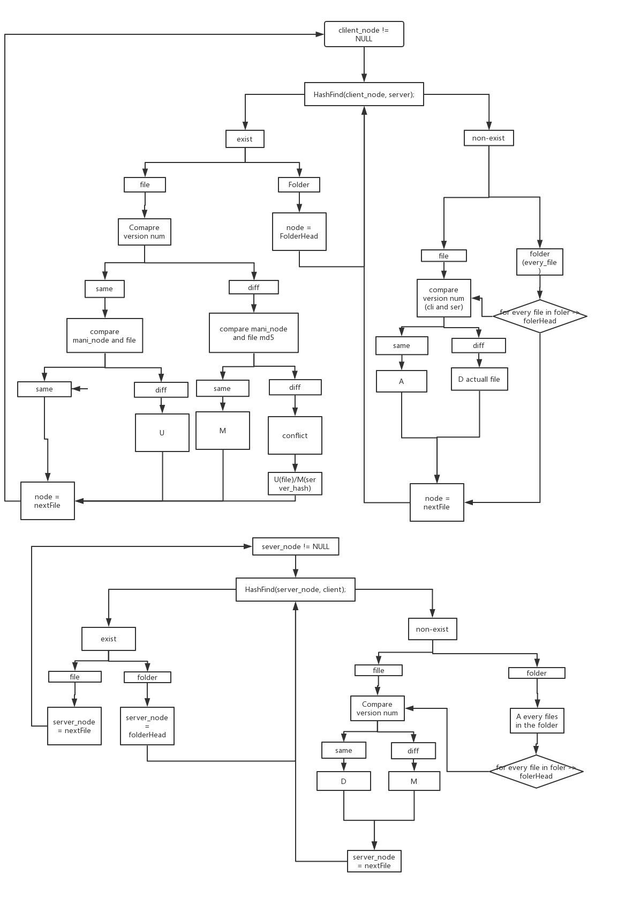

## WTF - A Version Control tool Implemented By Socket

### Synopsis

```
./WTF configure <IP/hostname> <port>
./WTF checkout <project name>
./WTF update <project name>
./WTF upgrade <project name>
./WTF commit <project name>
./WTF push <project name>
./WTF create <project name>
./WTF destroy <project name>
./WTF add <project name> <filename>
./WTF remove <project name> <filename>
./WTF currentversion <project name>
./WTF history <project name>
./WTF rollback <project name> <version>
```

### Notes

To run this project, please first run **chmod +x WTFtest.sh**. And then use the command **./WTFtest.sh**.

The WTF basically uses the socket communication. The version control implementation is realized in socket. To use this tool, please run this program, please make first. And using two terminals to enter into **client** folder and **server** folder.

For **client** folder, using **./WTF configure <IP/hostname> <port>** to create **.configure** file. Keep the **port** as same as the server. Then set the connection on the **server** folder by using **./WTFserver <port>** to set the server.

For the file communication mechanism, we develop the following scheme:


The main idea is comparing the files according to the hash and version, if the on the client and can be found in the server's manifest, and has the different version number, then this file needs to be **U**; If the file has the different version number, but they have the same md5, then this file is modified, which means it needs to be changed from the server, if there is the conflict occurs, then the program will ask the user to preserve one version either on the client or the server. If the node on the server cannot be found on the client, which means it needs to be **D** or if they have the same version number. Otherwise, they should be marked **M**.

For the synchronization part, the strategy is mutex the client once a time during the execution period, this will promise we will never occur the deadlock since the deadlock only happens at least there are two deadlocks. So the deadlock prevention is implemented by the following codes:

```c
pthread_mutex_t client_mutex = PTHREAD_MUTEX_INITIALIZER;
pthread_mutex_lock(&client_mutex);
// lock resources
pthread_mutex_unlock(&client_mutex);
```
### License


Copyright © 2019 Dengpan Yuan and Yonggen Zhu.
This program is licensed under GNU GPL3+. There is no warranty, to the extent permitted by law.

### See Also

Git
